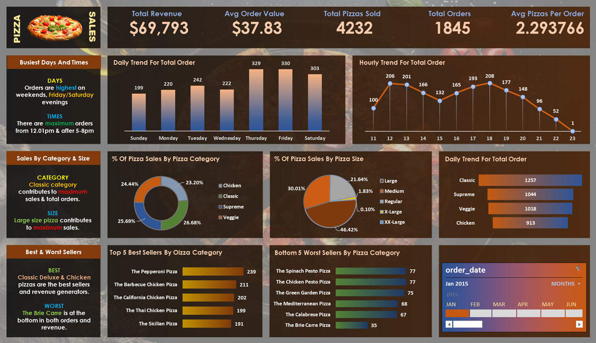
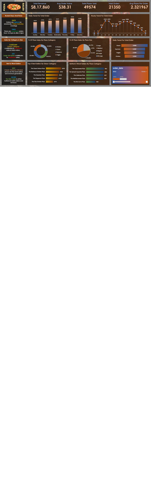
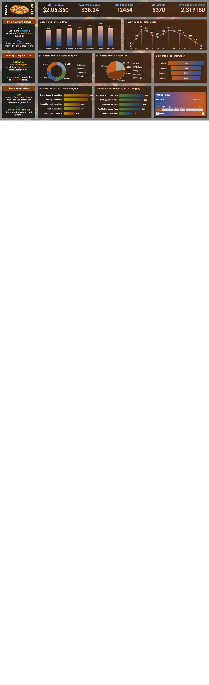

# 🍕 Pizza Sales Dashboard (SQL + Excel Analysis)

## 📌 Project Overview

This project presents a **complete end-to-end sales analysis** of a pizza restaurant's data for the year **2015**. Raw transactional data was queried and cleaned using **SQL**, and the final insights were visualized using **Excel (Power BI-style dashboards)**.

The goal was to uncover revenue trends, identify best/worst-performing products, understand customer ordering behavior, and provide actionable business insights.

---

## 📊 Dashboard Views

| View | Period | Revenue |
|------|--------|---------|
| 📅 January 2015 | Monthly | $69,793 |
| 📅 February 2015 | Monthly | $65,160 |
| 📅 Q1 2015 | Quarterly | $2,05,350 |
| 📅 Full Year 2015 | Annual | $8,17,860 |

---

## 🔢 Key Metrics Tracked

| Metric | Jan 2015 | Feb 2015 | Q1 2015 | Full Year 2015 |
|--------|----------|----------|---------|----------------|
| 💰 Total Revenue | $69,793 | $65,160 | $2,05,350 | $8,17,860 |
| 🧾 Avg Order Value | $37.83 | $38.67 | $38.24 | $38.31 |
| 🍕 Total Pizzas Sold | 4,232 | 3,961 | 12,454 | 49,574 |
| 📦 Total Orders | 1,845 | 1,685 | 5,370 | 21,350 |
| 📐 Avg Pizzas Per Order | 2.29 | 2.35 | 2.32 | 2.32 |

---

## 📈 Dashboard Highlights

### 🏆 Best Sellers (Full Year)
- **Classic Deluxe Pizza** — 2,453 units
- **Barbecue Chicken Pizza** — 2,432 units
- **Hawaiian Pizza** — 2,422 units
- **Pepperoni Pizza** — 2,418 units
- **Thai Chicken Pizza** — 2,371 units

### ❌ Worst Sellers (Full Year)
- **Brie Carre Pizza** — 490 units
- **Mediterranean Pizza** — 934 units
- **Calabrese Pizza** — 937 units
- **Spinach Supreme Pizza** — 961 units

### 📦 Sales by Pizza Category (Full Year)
| Category | % Share |
|----------|---------|
| Classic | ~26.91% |
| Supreme | ~25.46% |
| Veggie | ~23.68% |
| Chicken | ~23.96% |

### 📐 Sales by Pizza Size (Full Year)
| Size | % Share |
|------|---------|
| Large | ~45.89% |
| Medium | ~30.49% |
| Regular | ~~21.77% |
| X-Large / XX-Large | ~1.72% |

---

## ⏰ Business Insights

- 📅 **Busiest Days:** Orders are highest on **weekends**, especially **Friday & Saturday evenings**
- 🕐 **Peak Hours:** Most orders come in between **12:00–1:00 PM** and **5:00–8:00 PM**
- 🏷️ **Top Category:** **Classic** pizzas lead in both total orders and revenue
- 📏 **Top Size:** **Large** pizzas contribute the most to overall sales
- 📉 **Worst Performer:** The **Brie Carre Pizza** consistently ranks at the bottom in both orders and revenue

---

## 🛠️ Tools & Technologies Used

| Tool | Purpose |
|------|---------|
|  | Data extraction, cleaning, aggregation |
|  | Data visualization & dashboard creation |

---
## 📸 Dashboard Snapshots:

### 🧭 Overview Dashboard


### 📘 Year 2015 Dashboard


### 🧭 First Quarter Dashboard



## 📂 Project Files

| File | Description |
|------|-------------|
| `pizza_sales excel file.xlsx` | Main Excel dashboard file |
| `PizzaDashboard.png` | Screenshot of Overview section |
| `PizzaDashYear.png` | Screenshot of Yearly Sale |
| `PizzaDashQ1.png` | Screenshot of 1st Quarter Sale |

## 📁 Project Structure

```
pizza-sales-dashboard/
│
├── 📂 SQL Queries/
│   ├── total_revenue.sql
│   ├── best_worst_sellers.sql
│   ├── sales_by_category.sql
│   ├── sales_by_size.sql
│   └── hourly_daily_trends.sql
│
├── 📂 Dashboard Screenshots/
│   ├── PizzaDashboard.png      # January 2015
│   ├── PizzaDashFeb.png        # February 2015
│   ├── PizzaDashQ1.png         # Q1 2015
│   └── PizzaDashYear.png       # Full Year 2015
│
├── 📊 PizzaSalesDashboard.xlsx  # Excel Dashboard File
└── 📄 README.md
```

---

## 🙌 Feedback & Contribution

**Feedback is welcome!**  
Feel free to open an issue or share suggestions for improvement.  
If you found this project useful or inspiring, don't forget to ⭐ star the repo!

---

## 📬 Connect with Me

Let’s connect and collaborate!

- [LinkedIn – Karishma Sawant](https://www.linkedin.com/in/karishmaasawant)

⭐ *If you found this project helpful, consider giving it a star!*
